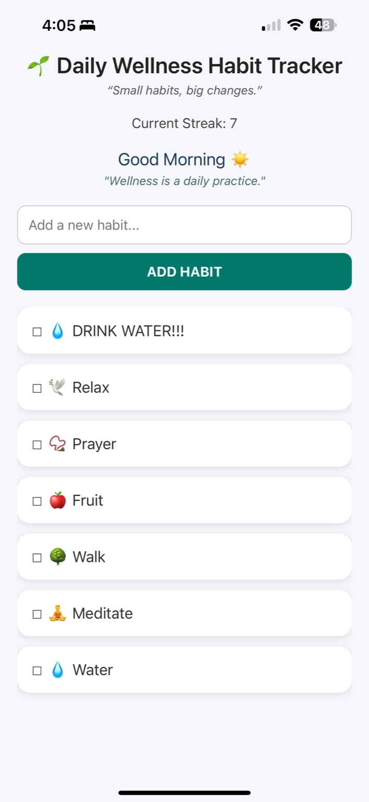

# 🌱 Daily Wellness Habit Tracker

This is a simple mobile app I built using **React Native + Expo** to help users stay consistent with small daily habits.  
It’s designed to be light, casual, and fun something that helps without feeling too serious or overwhelming.


---

## ✅ Features

- Add your own custom habits (e.g., *drink water*, *meditate*, *take a walk*)
- Displays a motivational quote + greeting based on the time of day
- Automatically adds emojis to habits based on keywords (e.g., `"water"` → 💧)
- Tap to check habits off as completed
- Long-press to delete habits
- Tracks current streak
- All data saved locally with AsyncStorage

---

## 📋 Project Workflow

This project followed an Agile-inspired workflow:

- Created a backlog of core features and tasks
- Planned iterations using simple issue tracking
- Manually tested features at each stage
- Documented decisions and architecture in this repo

---

## 🧠 Architecture Decisions

- Chose React Native with Expo for fast mobile deployment and testing
- Used local storage with AsyncStorage to avoid login/setup barriers
- Avoided third-party UI kits to keep the app lightweight and customized
- Designed all UI with accessibility and speed in mind

---

## How To Run:
```bash
npm install
```
```bash
npx expo start
```

- Then just scan the QR code using the **Expo Go App**.
- Or press w to run in the browser.

---

## 🎯 Why I Built This
I wanted to build something useful and real an app I’d actually use myself.
This project helped me explore UI/UX thinking, local data handling, and managing a mini Agile process from start to finish.

I care about building things that are:
- Helpful
- Easy to use
- Well-structured and clean under the hood

---

## 📸 Screenshot

Here’s a quick look at the app in action:



---

## About Me:

Hi, I’m Saleh Bafagih a Computer Programming & Analysis student at Seneca College.
I enjoy creating apps that solve everyday problems in simple, clean ways.